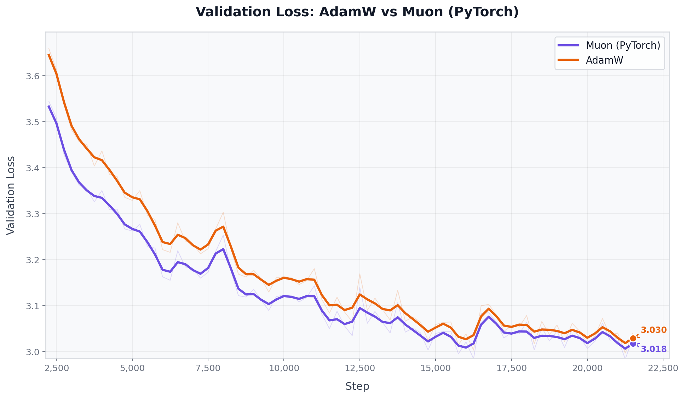
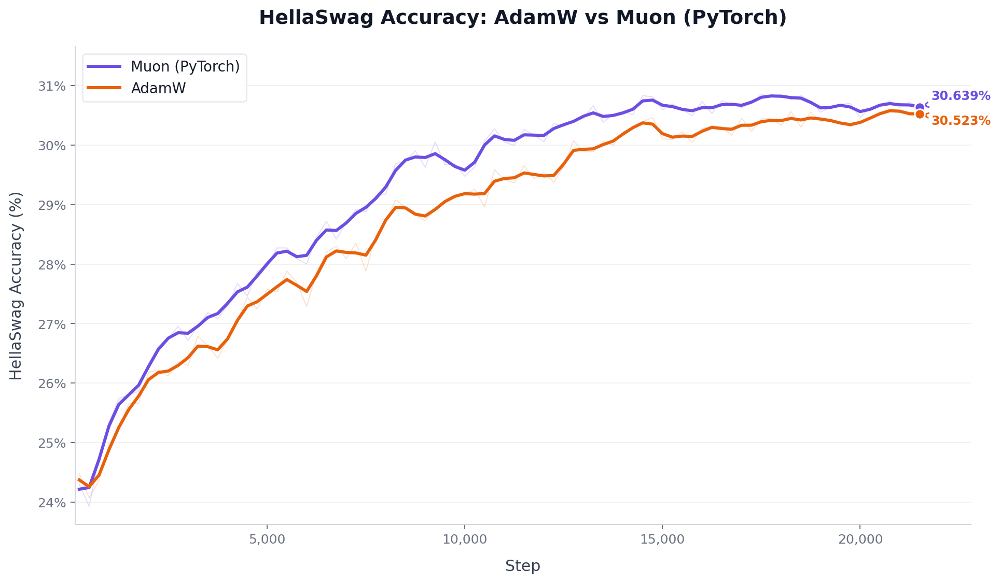
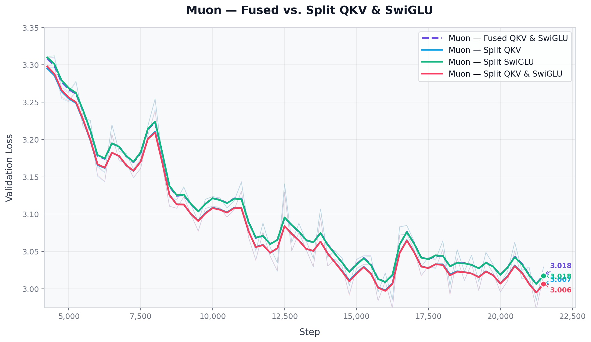
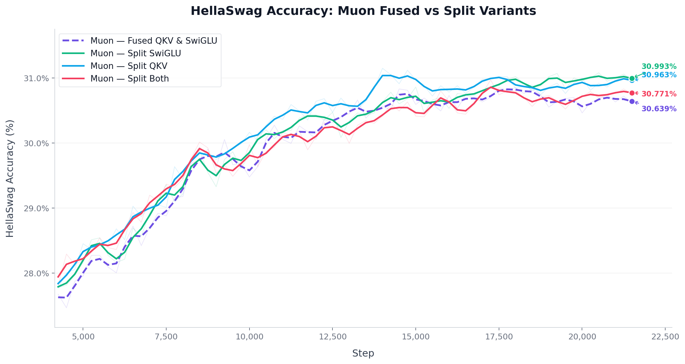

# LLM Pretraining Research

Research codebase for pretraining decoder-only GPT models (~240M parameters) on a single NVIDIA B200 GPU. Focuses on the [Muon optimizer](https://github.com/KellerJordan/Muon), projection splitting, and Mixture of Experts architectures.

The full writeup is published [on my blog](https://kirilluka.com).

---

## Overview

Two main research questions:

1. **Muon vs AdamW** — Does Muon's orthogonalized gradient update outperform AdamW at ~240M scale on FineWeb Edu?
2. **Projection Splitting** — Does splitting fused QKV and SwiGLU projections into separate linear layers improve Muon's effectiveness? (Muon orthogonalizes each weight matrix independently, so fusing projections forces a joint orthogonal constraint across semantically distinct roles.)

A third experiment adds **fine-grained Mixture of Experts** (DeepSeek-style: shared + routed experts) on top of the best optimizer config.

---

## Results

### Phase 1: AdamW vs Muon

| Metric | Muon (PyTorch) | AdamW | Δ |
|---|---|---|---|
| Best Val Loss ↓ | **2.9843** | 2.9971 | **−0.0128** |
| Best HellaSwag ↑ | **30.850%** | 30.601% | **+0.249pp** |




### Phase 2: Projection Splitting

| Config | Val Loss ↓ | Δ | HellaSwag ↑ | Δ |
|---|---|---|---|---|
| AdamW | 2.9971 | — | 30.601% | — |
| Muon — Fused | 2.9843 | −0.0128 | 30.850% | +0.249pp |
| Muon — Split SwiGLU | 2.9843 | −0.0128 | 31.079% | +0.478pp |
| Muon — Split Both | **2.9728** | **−0.0243** | 30.970% | +0.369pp |
| Muon — Split QKV | 2.9729 | −0.0242 | **31.149%** | **+0.548pp** |




Splitting QKV consistently helps. Splitting the SwiGLU MLP did not provide additional benefit at this scale.

---

## Repository Structure

```
GPT/
├── pretrain.py                     # Main entry point (Hydra-based launcher)
├── config/
│   ├── config_basemodel.yaml       # Base model and training config
│   └── experiments/                # Per-experiment config overrides
│       ├── exp_baseline_adamw.yaml
│       ├── exp_300m_base.yaml
│       ├── exp_muon_fused.yaml
│       ├── exp_muon_split_qkv.yaml
│       ├── exp_muon_split_mlp.yaml
│       ├── exp_muon_split_both.yaml
│       └── exp_moe.yaml
├── scripts/
│   ├── baseline_model.sh           # SLURM job for a single run
│   ├── run_experiments.sh          # Sequentially submits multiple experiments
│   └── data_prep/
│       └── hellaswag.py            # Downloads and parses HellaSwag benchmark
├── src/
│   ├── datasets/
│   │   └── dataloader.py           # Memory-mapped token shard loader
│   ├── eval/
│   │   └── metrics.py              # Validation loss + HellaSwag evaluation
│   ├── models/
│   │   ├── gpt.py                  # Standard GPT (fused QKV + SwiGLU + RoPE)
│   │   ├── gpt_split.py            # GPT with separate Q/K/V and optional split MLP
│   │   └── gpt_moe.py              # GPT with fine-grained MoE (shared + routed experts)
│   ├── training/
│   │   └── trainer_single_gpu.py   # Training loop, LR schedule, checkpointing, wandb
│   └── utils/
│       ├── helpers.py              # RoPE, FLOPs estimation, param counting
│       └── optimizers.py           # Muon optimizer + DualOptimizer wrapper
└── graphs/                         # Training curves and evaluation plots
```

---

## Setup

```bash
conda create -n LLM python=3.11
conda activate LLM
pip install -r requirements.txt
```

`transformer_engine` requires CUDA 12+ and is only needed for the MoE model. If you are not using `exp_moe`, you can skip it.

---

## Data

Training uses [FineWeb Edu](https://huggingface.co/datasets/HuggingFaceFW/fineweb-edu) pre-tokenized `.npy` shards. Place or symlink shards at:

```
data/edu_fineweb350B/
```

For HellaSwag evaluation:

```bash
python scripts/data_prep/hellaswag.py
```

This downloads the validation split to `data/hellaswag/`.

---

## Running Experiments

### Single run (interactive)

```bash
conda activate LLM
python pretrain.py +experiments=exp_baseline_adamw
```

### Single run via SLURM

```bash
sbatch scripts/baseline_model.sh
```

Edit `baseline_model.sh` to change `--config-name` if you want a different experiment.

### Multiple experiments sequentially via SLURM

```bash
sbatch scripts/run_experiments.sh
```

Edit the `EXPERIMENTS` array in `run_experiments.sh` to select which configs to run.

### Experiment configs

| Config name | Description |
|---|---|
| `exp_baseline_adamw` | AdamW only — baseline |
| `exp_300m_base` | AdamW, same 240M architecture |
| `exp_muon_fused` | Muon with default fused QKV + SwiGLU |
| `exp_muon_split_qkv` | Muon with Q, K, V as separate linear layers |
| `exp_muon_split_mlp` | Muon with split SwiGLU gate/up projections |
| `exp_muon_split_both` | Muon with split QKV and split MLP |
| `exp_moe` | Fine-grained MoE (shared + routed experts) with Muon |

Each config file only specifies the fields that differ from `config/config_basemodel.yaml`.

---

## Checkpointing

Training resumes automatically if a checkpoint exists at `output/<run_name>/checkpoint.pt`. No flag is needed — the trainer checks on startup and picks up from the saved step, optimizer state, and dataloader position.
